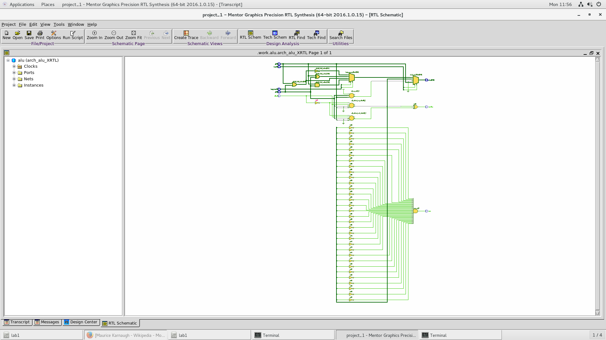
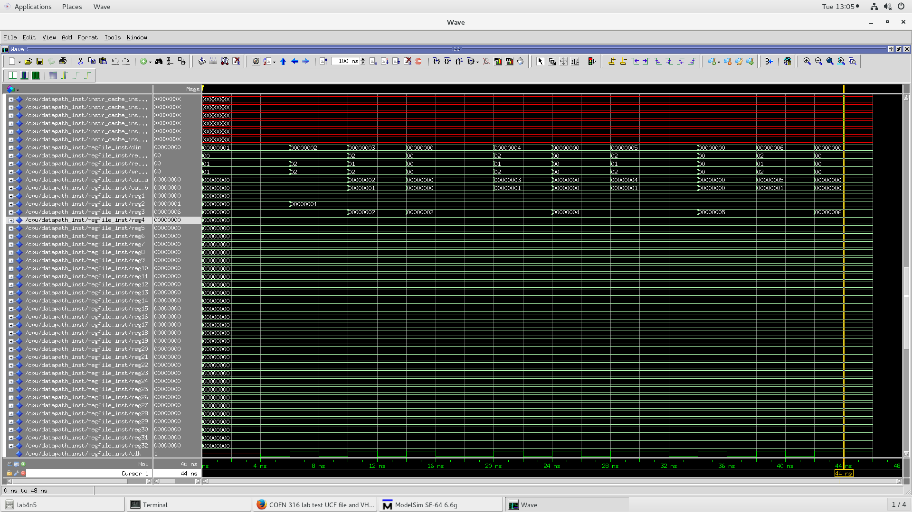
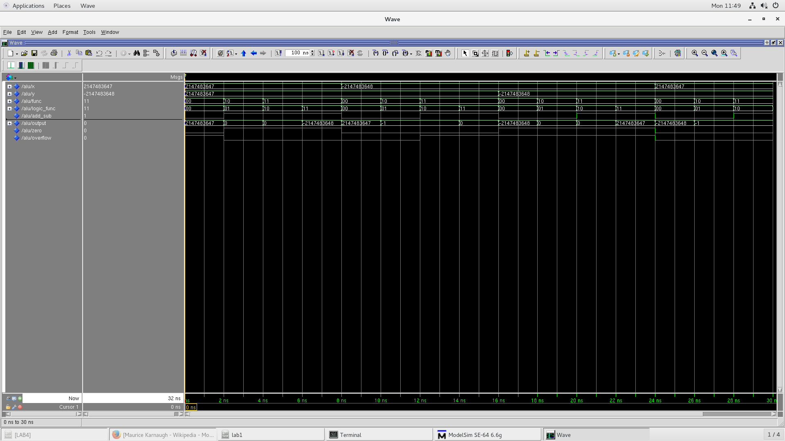

# Compatible Instructions

Instructions are read from an instruction cache component. Memory accesses like store and load are stored in a data cache component instead of RAM memory.

There are 20 compatible instructions:
- Register instructions:
    - Addition
    - Substraction
    - Set less than
    - AND
    - OR
    - XOR
    - NOR
- Immediate instructions:
    - Load upper immediate
    - Set less than immediate
    - ADD immediate
    - AND immediate
    - OR immediate
    - XOR immediate
    - Load word
    - Store word
- Conditional instructions:
    - Branch less than 0
    - Branch equal
    - Branch not equal
- Jump instructions:
    - Unconditional jump instruction
    - Unconditional jump instruction from address in the register file

# Synthesized Components

## CPU

## ALU

## Datapath

# Simulations

## CPU Simulation

## ALU Simulation

